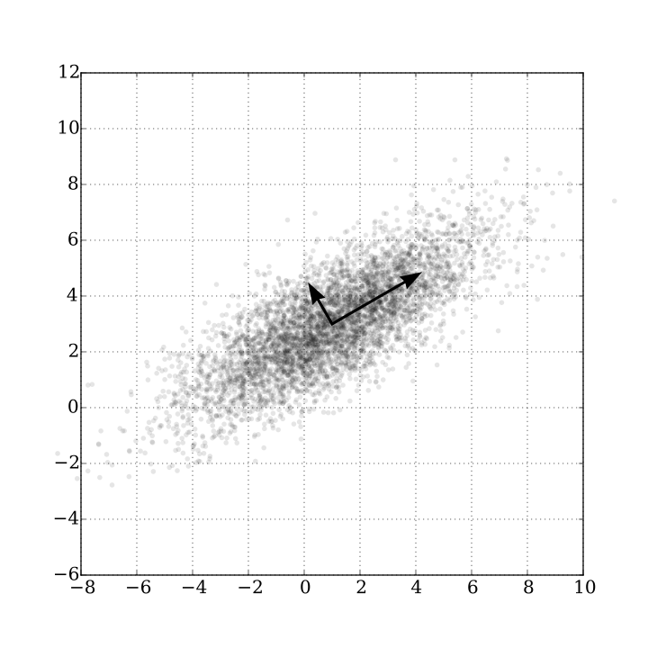
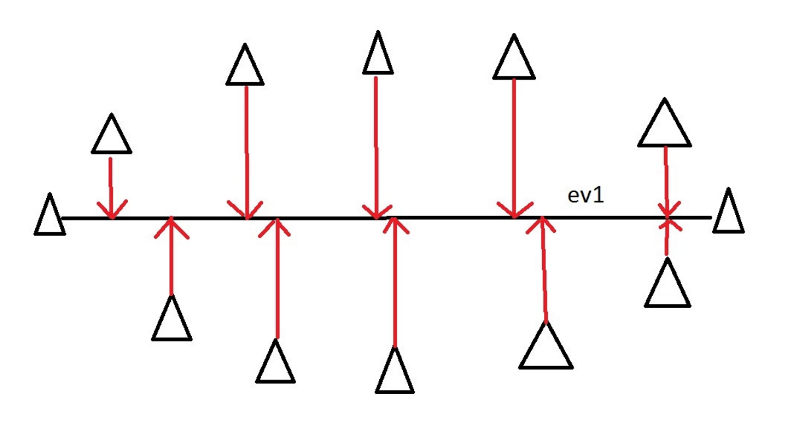
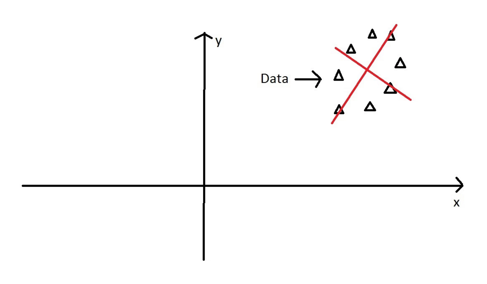
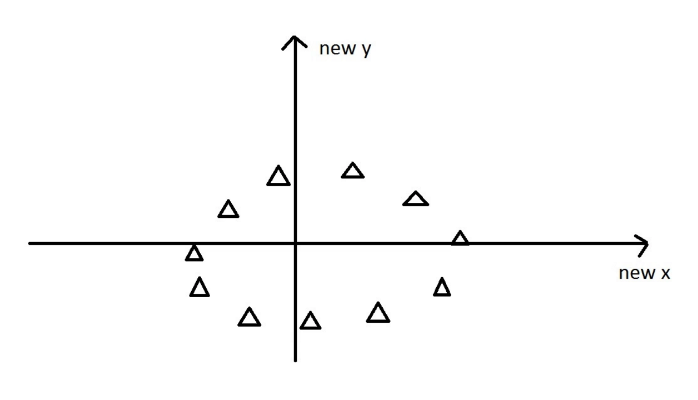
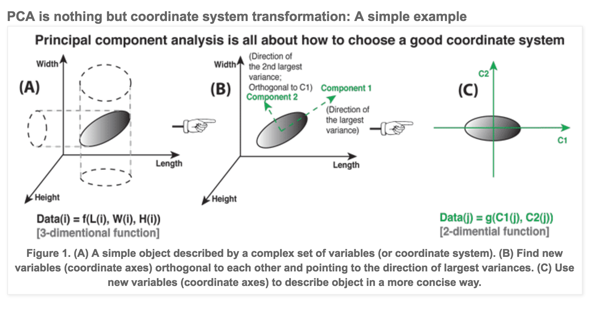
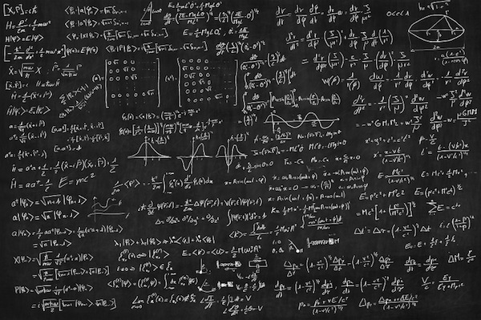

# A Brief Introduction to Principal Component Analysis
### Immeidately followed by a longer introduction...

#### Author: Justin Pounders, DSI-ATL-3

---
[.build-lists: true]

# PCA = Principle Component Analysis

**Goals**: 

- *Transform* original variable/features into new, "high-performance" features
- *Reduce* the dimensionality of the data
- *Eliminate* multicollinearity

---

# Intro to PCA

Say that I want to predict **age** from *stress*, *income* and *health*.

1. Three-dimensional data
2. Multicollinearity probably exists

*PCA* will give me one or two **super-predictor** variables called *components* (hopefully).

---

# Intro to PCA

Principal components:

$$ PC1 = w_{1,1}(\text{stress}) + w_{2,1}(\text{income}) + w_{3,1}(\text{health})$$

$$ PC2 = w_{1,2}(\text{stress}) + w_{2,2}(\text{income}) + w_{3,2}(\text{health})$$

$$ PC3 = w_{1,3}(\text{stress}) + w_{2,3}(\text{income}) + w_{3,3}(\text{health})$$

---

# Intro to PCA

This is cool because...

- $$PC1$$ is better than $$PC2$$ is better than $$PC3$$
  
- All of these are *uncorrelated*

---

# Now for the slightly longer version...

---

# Motivation

- *Dimensionality reduction* reduces the number of random variables that you are considering for analysis 
- To get a quick summary of our data, we can calculate a *covariance matrix*, an unstandardized correlation matrix.

---

# Motivation

**What would an 'ideal' covariance matrix look like?**
- Large numbers on diagonal
- Small numbers off diagonal

---
[.build-lists: true]

# Principal Component Analysis

- PCA finds *linear combinations* of current predictor variables that...
- create new "principal components". The principal components explain...
- the maximum possible amount of variance in your predictors.

---

> Think of PCA as a coordinate transformation.  The old axes are the original variables (columns). The new axes are the principal components from PCA.

---

---

---

 

---

 

---

 

---

# Mathematical Details

- We are looking for new *directions* in feature space
- Each consecutive direction tries to maximize *remaining variance*
- Each direction is *orthogonal* to all the others

---

# What does that mean?

The inputs `stress`, `income` and `health`...

...can be *replaced* with 3 *new* variables...

- `PC1` $$\rightarrow$$ most variance
- `PC2`
- `PC3` $$\rightarrow$$ least variance (noise?)

---

# Principal components

$$ PC1 = w_{1,1}(\text{stress}) + w_{2,1}(\text{income}) + w_{3,1}(\text{health})$$

$$ PC2 = w_{1,2}(\text{stress}) + w_{2,2}(\text{income}) + w_{3,2}(\text{health})$$

$$ PC3 = w_{1,3}(\text{stress}) + w_{2,3}(\text{income}) + w_{3,3}(\text{health})$$

---

# Explaining PCA

The weights are called *loadings*

- They are coefficients indicating how heavily each of the input data are weighted

e.g.

$$ PC1 = 0.01(\text{stress}) - 0.54(\text{income}) + 0.71(\text{health})$$

> We will see how to get these values from `sklearn`

---

# Explaining PCA

The total variance of your data gets redistributed among the principal components:

$$\text{var}(PC1) > \text{var}(PC2) > \text{var}(PC3)$$

---

# Interpreting PCA: Signal v. Noise

PCA attempts to *maximize signal* (high variance) while *isolating noise* (low variance)

- Most variance captured in first several principal components
- Noise isolated to last several principal compoments
- This done simultaneously across *all input variables*

---

# Explaining PCA

There is no covariance between principal components

$$\text{covar}(PC1, PC2) = 0$$

$$\text{covar}(PC1, PC3) = 0$$

$$\text{covar}(PC2, PC3) = 0$$

---

---

# The Math Foundation

**Eigenvalue decomposition of covariance matrix**
This diagonalizes the covariance matrix.

**The principal component transformation**
This transforms each input variable onto a new orthogonal basis in which the new variables are maximally variant.

$$ \mathbf{Z = XW} $$

---

> *Introduction to Statistical Lerning* section 10.2 has a great overview that is of medium technical complexity.

---

# Summary

1. What is the output of PCA?
2. Why is PCA useful?

Turn and talk.

---

# [fit] Python Time

Go to `intro-to-PCA.ipynb`.

